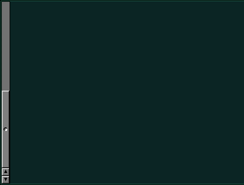

## neXtaw & Xterm build with neXtaw

Run build.sh to

- configure, make and install nextaw
- configure, make and install xterm with nextaw

## Xresources:

For NeXT-style scrollbar, add to your .Xresources/.Xdefaults:

	XTerm*scrollBar:                true
	XTerm.vt100.scrollbar.background: gray50
	XTerm.vt100.scrollbar.foreground: gray20
	XTerm.vt100.scrollbar.width: 14 

